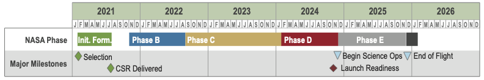
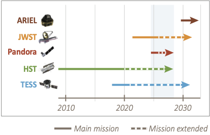

# About Pandora

{: .center}

## What is Pandora

Pandora is a SmallSat mission designed to study the atmospheres of exoplanets, and was selected as part of NASA's Astrophysics Pioneers Program. Transmission spectroscopy of transiting exoplanets provides our best opportunity to identify the makeup of planetary atmospheres in the coming decade. Stellar brightness variations due to star spots, however, can impact these measurements and contaminate the observed spectra. Pandora's goal is to disentangle star and planet signals in transmission spectra to reliably determine exoplanet atmosphere compositions. Pandora will collect long-duration photometric observations with a visible-light channel and simultaneous spectra with a near-IR channel. The broad-wavelength coverage will provide constraints on the spot and faculae covering fractions of low-mass exoplanet host stars and the impact of these active regions on exoplanetary transmission spectra. Pandora will subsequently identify exoplanets with hydrogen- or water-dominated atmospheres, and robustly determine which planets are covered by clouds and hazes. Pandora will observe at least 20 exoplanets with sizes ranging from Earth-size to Jupiter-size and host stars spanning mid-K to late-M spectral types.

The project is made possible by leveraging investments in other projects, including an all-aluminum 0.45-meter Cassegrain telescope design, and a NIR sensor chip assembly from the James Webb Space Telescope. The mission will last five years from initial formulation to closeout, with one-year of science operations. Launch is planned for the mid-2020s as a secondary payload in Sun-synchronous low-Earth orbit. By design, Pandora has a diverse team, with over half of the mission leadership roles filled by early career scientists and engineers, demonstrating the high value of SmallSats for developing the next generation of space mission leaders.    

## Pandora schedule

The Pandora mission will complete the science objectives proposed, archive the data, and publish results within a 5-year timeline. Launch would occur in the mid-2020s, although the precise timeline is dependent on a ride-sharing agreement.

{: .center}

Pandora is expected to operate concurrently with JWST. JWST has four science instruments with modes for observing transiting exoplanets to high precision and longer IR wavelengths; however, stellar contamination will persist for JWST transmission spectra. We anticipate the opportunity for simultaneous observations in which JWST will do short-baseline deep dives and Pandora will provide long-baseline and visible-band observations.

{: .center}

## Pandora Payload

{: .center}

The Pandora payload is built around an all-aluminum 0.45-m Cassegrain telescope design. The telescope is designed to address the challenge of procuring high-performing imaging space systems in a ride-sharing form-factor that are low cost and have rapid acquisition. To help address these challenges, the telescope design minimizes space-vehicle dependencies and maximizes customizability of the aft optics to accommodate a variety of optical configurations. Compared to traditional glass optics, aluminum telescopes are more suited to large-scale manufacturing and batch production. Combined with mechanical interfaces that are machined in parallel with optical surfaces, the telescope has a significant cost- and schedule- advantage over other designs.
