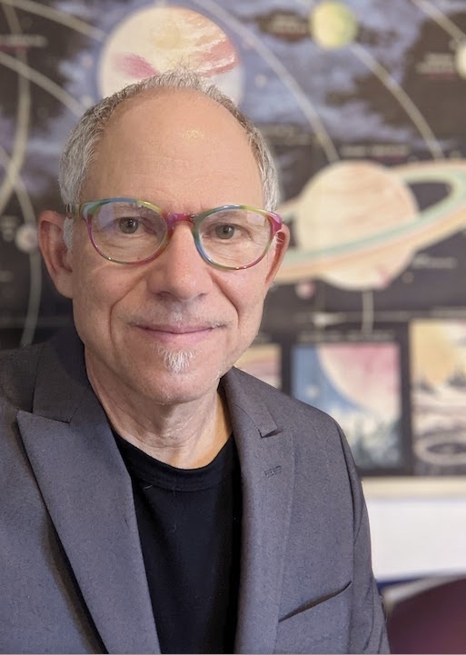

{ class=avatar }
Thomas Greene is an astrophysicist in the Space Science and Astrobiology Division at NASA's Ames Research Center. He is a co-investigator on the NIRCam and MIRI science instruments of the James Webb Space Telescope, and he is leading JWST guaranteed time programs to characterize the atmospheres of transiting exoplanets and protostars. Tom is leveraging his expertise with developing the NIRCam slitless spectroscopy mode to optimize Pandora's design, testing, calibrations, and operations. Before joining NASA, he worked at the Lockheed Martin Advanced Technology Center on NASA astrophysics missions. Prior to that, Tom was on the faculty of the University of Hawaii where he was a support astronomer and later Director of the NASA Infrared Telescope Facility (IRTF). He received his Ph.D. in astronomy from the University of Arizona.
