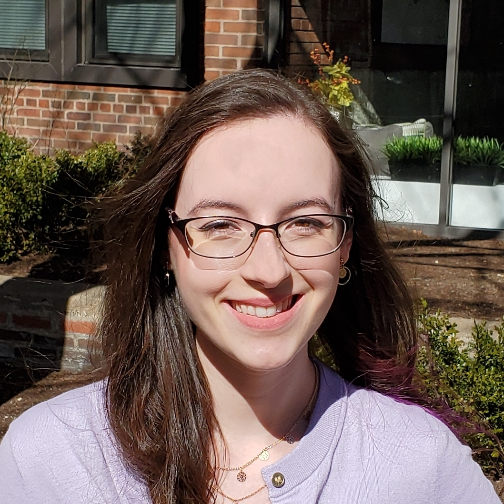

{ class=avatar }
Megan Mansfield is a NASA Sagan Postdoctoral Fellow working with Professor Dániel Apai at the University of Arizona’s Steward Observatory. Megan’s research focuses on the spectroscopic characterization of exoplanet atmospheres. She uses a variety of ground-based and space-based observations to study planetary formation, physics, chemistry, and habitability. Megan received her PhD from the University of Chicago in 2021, where she performed spectroscopic observations and modeling of highly irradiated exoplanets, ranging in size from hot terrestrial planets to ultra-hot Jupiters.
