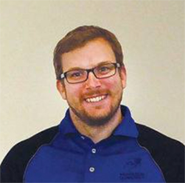

{ class=avatar }
Dr. James Mason is an expert in small satellites, having worked on over 20 of them in the past decade. He was heavily involved in every aspect of the highly successful [MinXSS CubeSats](http://lasp.colorado.edu/home/minxss/) and is the Principal Investigator of the recently awarded Sun Coronal Ejection Tracker (SunCET) CubeSat. His role on Pandora is to provide advice about development and operation of small satelites, connections to other teams, and guidance on useful tools that have been used on other projects. 
